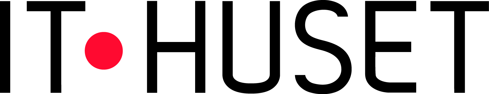
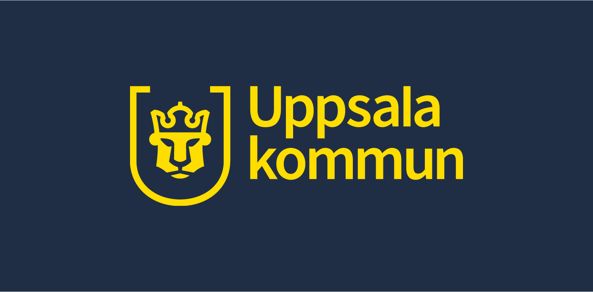

## tl; dr

- När: 11.12.2021 08:00 -> Open ended
- Var: Dragarbrunnsgatan 50 (Svavagallerian) @ Caspeco
- Vad: Hacka för ett hållbarare Uppsala!
- Varför: 
  - Du bidrar till ett bättre Uppsala!
  - Du bygger ditt eget nätverk 
  - Du bidrar till en ännu mer levande IT-Community i Uppsala!

***

  <table id="sponsor-table">
    <tr>
      <td></td>
      <td></td>
      <td></td>
    </tr>
  </table>

